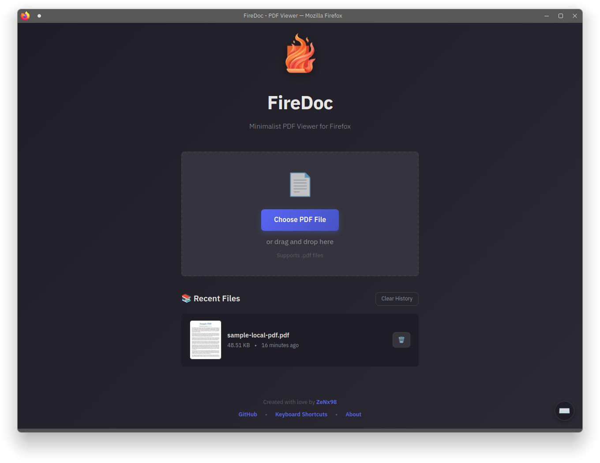
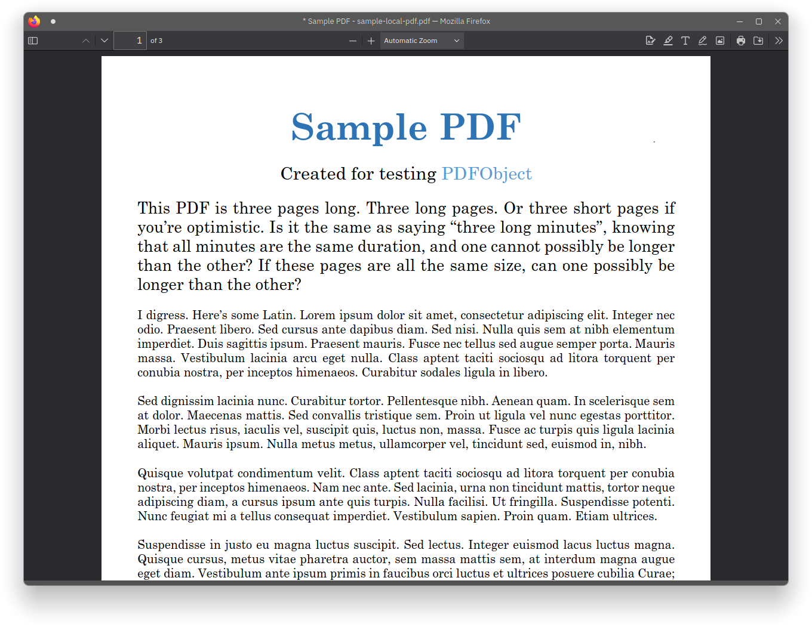

<p align="center">
  
</p>

<h1 align="center">FireDoc</h1>

<p align="center">A beautiful, minimalist PDF viewer and editor for Firefox with a distraction-free interface</p>

---

## What is this?

Firefox comes with a great built-in PDF viewer and editor, but using it solely as a PDF reader may not be visually appealing due to its web browser user interface. Fortunately, the FireDoc installation script can create a separate profile dedicated to reading and editing PDFs. Additionally, the script adds custom CSS to hide the browser's UI elements, giving the appearance of a dedicated PDF reader.

## ✨ Features

### 🎨 **Beautiful User Interface**
- **Custom Start Page** - Modern, gradient-styled landing page with drag-and-drop support
- **Dark Theme** - Eye-friendly dark interface optimized for reading
- **Smooth Animations** - Polished transitions and hover effects

### 📚 **Recent Files Management**
- **Smart Thumbnails** - Automatic first-page preview generation for quick file identification
- **Persistent History** - Recent files saved across browser sessions
- **File Metadata** - Shows filename, size, and last opened timestamp
- **Quick Access** - Click any recent file to reopen it
- **Clear History** - Remove individual files or clear all history

### 🚀 **Performance Optimized**
- **Chunked Reading** - Only loads first 5MB of PDFs for thumbnail generation
- **Efficient Storage** - Stores only thumbnails (~10-20KB each), not full files
- **Large File Support** - Works with PDFs of any size (tested with 500MB+ files)
- **Smart Timeouts** - Graceful fallbacks if preview generation takes too long
- **Memory Efficient** - Minimal resource usage even with multiple large files

### 🎯 **Enhanced Functionality**
- **Drag & Drop** - Simply drag PDF files onto the window
- **File Browser** - Click to browse and select PDFs
- **Keyboard Shortcuts** - Press `O` to open file dialog, `?` for help
- **Multiple File Support** - Handle multiple PDFs seamlessly
- **File Validation** - Ensures only valid PDF files are opened

### 🔒 **Privacy First**
- **Local Processing** - All files stay on your device
- **No External Services** - No data sent to any server
- **Isolated Profile** - Separate Firefox profile for PDF viewing
- **No Tracking** - Completely private PDF reading experience

## 🖼️ Screenshots

<p align="center">
  
  
</p>

<p align="center">
  <em>Left: Start page • Right: PDF viewer interface</em>
</p>

## 📦 Installation

### Prerequisites
- Firefox browser
- Linux operating system (tested on KDE)
- Git

### Quick Install
```bash
# Clone the repository
git clone https://github.com/ZeNx98/firedoc
cd firedoc

# Run the installation script
bash install.sh
```

The installation script will:
1. Create a dedicated Firefox profile for FireDoc
2. Install custom CSS to hide browser UI
3. Set up the beautiful start page
4. Create desktop entries and file associations
5. Install the FireDoc launcher

### Verification
After installation, FireDoc will be available in your application launcher and as a file association for PDF files.

## 🚀 Usage

### Method 1: Application Launcher
- Open your application launcher
- Search for "FireDoc"
- Launch the application
- Drag and drop a PDF or click "Choose PDF File"

### Method 2: File Browser
- Right-click any PDF file
- Select "Open with FireDoc"
- The PDF will open in the FireDoc viewer

### Method 3: Command Line
```bash
# Open FireDoc
firedoc

# Open a specific PDF
firedoc /path/to/document.pdf
```

### Method 4: Drag and Drop
- Launch FireDoc
- Drag any PDF file onto the window
- The file will open automatically

## ⌨️ Keyboard Shortcuts

| Key | Action |
|-----|--------|
| `O` | Open file browser |
| `?` or `/` | Show keyboard shortcuts help |
| Drag & Drop | Drop PDF files anywhere on the page |

## 🎨 Customization

FireDoc stores its configuration files in `~/.config/firedoc/` with the following structure:

### Configuration Files

```
~/.config/firedoc/
├── icon.png              # Application icon
├── startpage.html        # Custom start page UI
```

### Customizing the Start Page
Edit `~/.config/firedoc/startpage.html` to customize:
- Colors and theme
- Layout and styling  
- Welcome message
- Feature cards

## 🔧 Technical Details

### Architecture
- **Frontend**: HTML5, CSS3, Vanilla JavaScript
- **PDF Rendering**: PDF.js library (v3.11.174)
- **Storage**: localStorage for metadata, thumbnails
- **Profile**: Isolated Firefox profile

### Storage Limits
- **Recent Files**: Up to 10 files (configurable)
- **Thumbnail Size**: ~10-20KB per file
- **Total Storage**: ~5MB for all thumbnails (localStorage limit)

### Browser Compatibility
- **Tested**: Firefox (latest versions)
- **Platform**: Linux 
- **Note**: May require adjustments for other platforms

## 🐛 Troubleshooting

### Large PDFs Not Showing Thumbnails
- Large PDFs (>100MB) may take longer to generate previews
- If preview fails, a placeholder icon is shown
- The file is still added to recent files and can be opened

### Recent Files Not Persisting
- Check browser localStorage is enabled
- Verify `~/.config/firedoc/` directory has write permissions
- Clear browser cache if issues persist

### FireDoc Not Appearing in App Launcher
```bash
# Reinstall desktop entries
bash install.sh
update-desktop-database ~/.local/share/applications/
```

### PDFs Opening in Default Browser
```bash
# Reset file associations
xdg-mime default firedoc.desktop application/pdf
```

## 🤝 Contributing

Contributions are welcome! Please feel free to submit a Pull Request. Areas for improvement:

- [ ] Support for other operating systems (Windows, macOS)
- [ ] Additional keyboard shortcuts
- [ ] Theme customization UI
- [ ] Multi-language support

## 📝 License

This project is licensed under the MIT License.  
Original work by [sdushantha](https://github.com/sdushantha)  
Modified and maintained by [ZeNx98](https://github.com/ZeNx98)

## 🙏 Acknowledgments

- [Mozilla PDF.js](https://mozilla.github.io/pdf.js/) - PDF rendering engine
- Firefox team for the excellent built-in PDF viewer

---

This project was heavily vibe coded!

**Star ⭐ this repository if you find it useful!**
